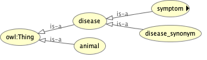
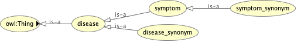

# Animal Disease Symptom Ontology (ADSO)

- Lastest implementation `ADSOv1.0.3.owl` specification published on https://animal-ds-ontology.web.app/
- Implemented using the Protege (https://protege.stanford.edu/)

## Structure




## Citations

```

@data{DVN/QX9ZAD_2023,
  author = {Bandara, Viraj Lakshitha},
  publisher = {Harvard Dataverse},
  title = {{Animal Disease Symptom Ontology}},
  year = {2023},
  version = {DRAFT VERSION},
  doi = {10.7910/DVN/QX9ZAD},
  url = {https://doi.org/10.7910/DVN/QX9ZAD}
}

```
